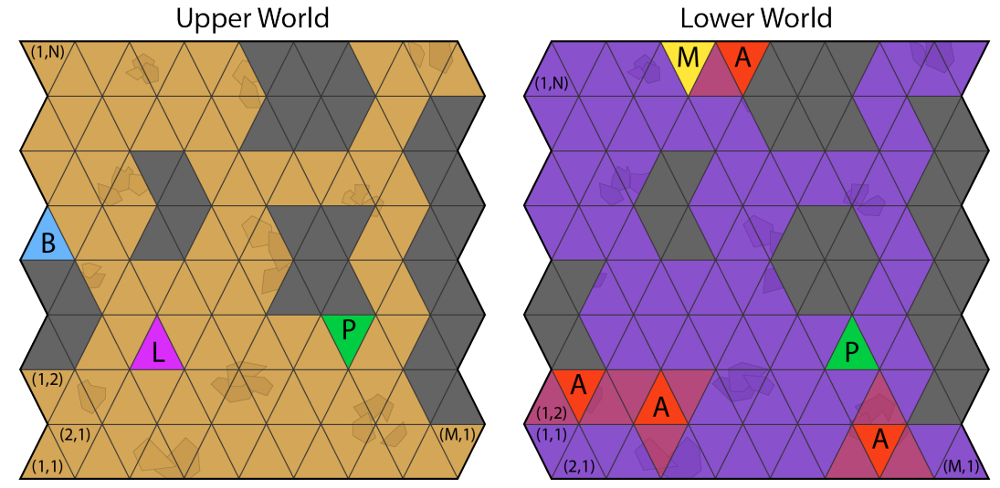

# Dynamic Programming and Optimal Control Programming Exercise

In this repository, we ([Jasper](https://www.linkedin.com/in/jaspertanzx/) and [Tian Yi](https://www.linkedin.com/in/tianyilim/)) show our solution for the  programming exercise of the [Dynamic Programming and Optimal Control (DPOC) course](https://idsc.ethz.ch/education/lectures/optimal-control.html) at ETH Zurich.

We are meant to solve the following problem: ([problem statement](doc/DPOC_2022_PE_Instructions.pdf)).

*A sample map of the problem.*

The robot needs to travel from **B** in the upper world to **M** in the lower world through one of the portals **P** in order to collect gems. It then needs to go to **L** in the upper world, again through a portal **P**, using gems.

While in the lower world, it can be attacked by aliens **A** with a chance of its gems being stolen. It can also be buffetted around (disturbed) from its intended actions.

This problem formulation is an example of a Stochastic Shortest Path (SSP) problem, which we are can solve with three methods.

1. Value Iteration
2. Policy Iteration
3. Linear Programming

We implement Value Iteration and Linear Programming solutions here in Matlab.

## Usage

1. Open up `main.m`
2. Choose whether to generate a random world or not with `generateRandomWorld`
   1. If a predefined world is chosen, choose which map to load with `predefined_map`. Accepted values are `exampleWorld_1.mat`, `exampleWorld_2.mat`, `exampleWorld_3.mat`.
3. Choose which solution in `sol_choice`
   1. Valid options are `"LP"` for Linear Programming and `"VI"` for Value Iteration

A map of the routes chosen by the policy will then pop up. Enjoy!